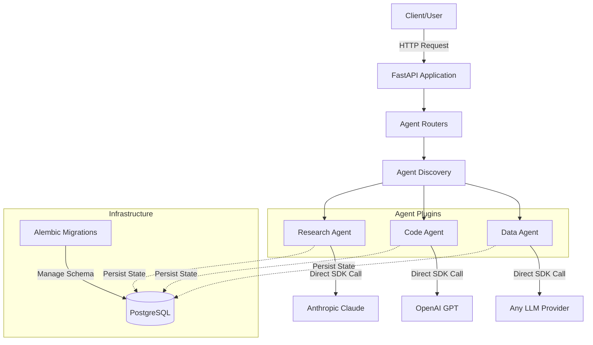
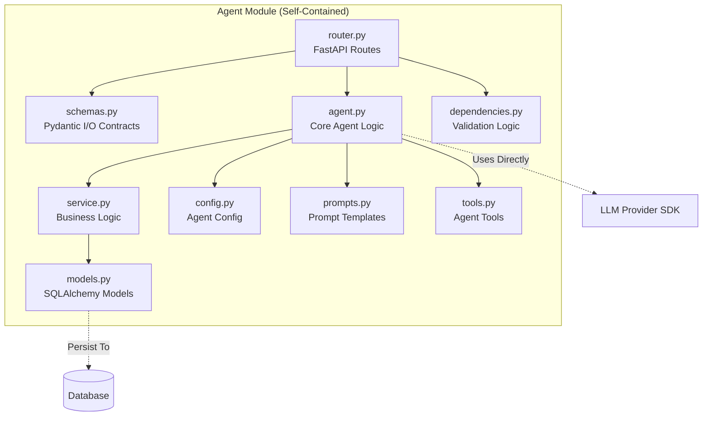
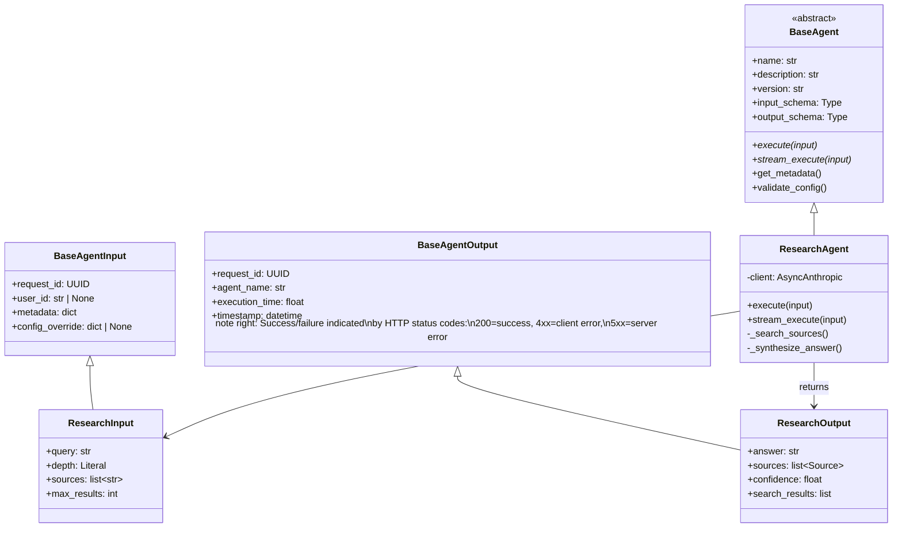
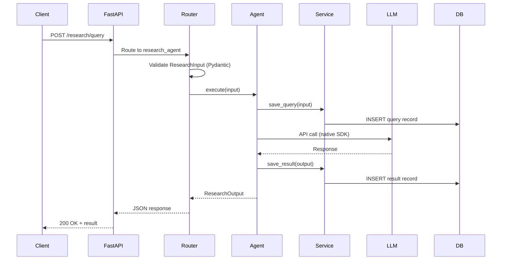
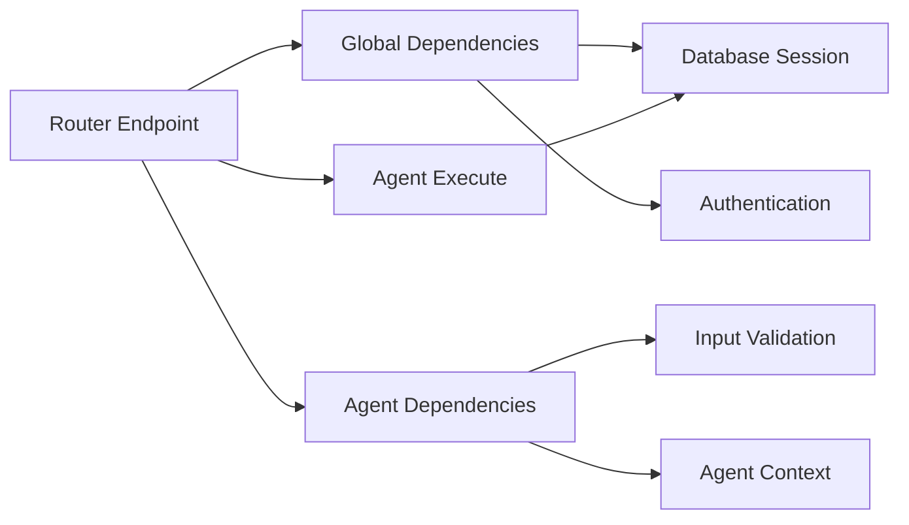
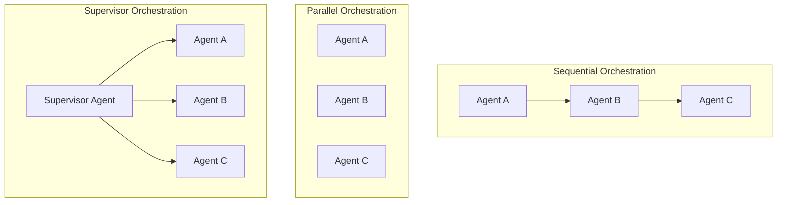

# Agentic AI FastAPI - System Architecture

## Overview

A minimal, plugin-based agentic AI system built on FastAPI, designed for rapid prototyping and testing of AI agents and agentic workflows. The architecture follows FastAPI best practices while providing a flexible foundation for building self-contained agents that can work independently or in orchestrated workflows.

### Core Philosophy

- **Minimal by design** - Start simple, add complexity only when needed
- **Agent as plugin** - Each agent is self-contained and independently deployable
- **Developer freedom** - Template provides structure, not implementation choices; use any LLM provider, framework, or pattern
- **Contract-based** - Clear Pydantic-based input/output contracts for all agents
- **Database-first** - Built-in persistence for agent state and results
- **FastAPI native** - Leverages FastAPI's strengths (async, validation, auto-docs)

## Goals

### Primary Goals

1. **Rapid Agent Development** - Add new agents in minutes with clear patterns
2. **Easy Testing** - Spin up endpoints quickly to test individual agents or workflows
3. **Type Safety** - Pydantic schemas ensure validation and clear contracts
4. **Self-Contained Agents** - Each agent owns its logic, tools, prompts, and data
5. **Auto-Discovery** - Agents register automatically without manual configuration
6. **Production-Ready Foundation** - Minimal but with database, migrations, and proper structure

### Secondary Goals

1. **Orchestration Support** - Enable multi-agent workflows when needed
2. **Observability** - Structured logging and request tracking
3. **Extensibility** - Easy to add shared utilities without breaking agent independence
4. **Developer Experience** - Clear patterns, good defaults, minimal boilerplate

## Non-Goals

### Explicitly Out of Scope

1. **❌ Template-Provided LLM Abstractions** - No generic interface wrapping OpenAI/Anthropic/etc.
   - *Rationale:* Each provider has unique features; abstractions leak and limit capabilities
   - *Developers are free to:* Use native SDKs, LangChain, LangGraph, Agno, etc. - whatever fits their agent's needs
   - *Template provides:* Structure and contracts, not implementation choices

2. **❌ Prescribed Agent Frameworks** - No required or built-in LangChain/LangGraph/Agno integration
   - *Rationale:* Different agents have different needs; don't impose framework choices
   - *Developers are free to:* Use any framework, library, or pattern per agent
   - *Template provides:* Plugin architecture where agents choose their own tools

3. **❌ Built-in Agent Marketplace** - No plugin discovery service or registry API
   - *Rationale:* YAGNI - can add later if needed
   - *Instead:* File-system based discovery is sufficient

4. **❌ Real-time Collaboration** - No multi-user simultaneous agent interaction
   - *Rationale:* Outside initial scope
   - *Instead:* Focus on single-user request/response patterns

5. **❌ Heavy Observability Stack** - No Prometheus/Grafana/Jaeger out of the box
   - *Rationale:* Start with structured logging; add metrics later
   - *Instead:* Structured JSON logs with request_id tracking

6. **❌ Microservices Architecture** - No service mesh, no separate agent deployments initially
   - *Rationale:* Start as monolith; can split later if needed
   - *Instead:* Single FastAPI app with modular agents

## System Architecture

### High-Level Architecture



### Agent Architecture



### Base Abstraction Hierarchy



### Request Flow



## Folder Structure

```
agentic-ai-fastapi/
├── alembic/                          # Database migrations
│   ├── versions/                     # Migration files
│   ├── env.py                        # Alembic environment
│   └── script.py.mako                # Migration template
│
├── docs/                             # Documentation
│   ├── architecture.md               # System architecture
│
├── src/                              # Application source
│   ├── agents/                       # Agent plugins
│   │   ├── __init__.py              # Auto-discovery logic
│   │   ├── base.py                  # Base agent abstraction
│   │   │
│   │   ├── research_agent/          # Example: Research Agent
│   │   │   ├── router.py           # FastAPI endpoints
│   │   │   ├── schemas.py          # ResearchInput/Output (Pydantic)
│   │   │   ├── models.py           # DB models (queries, results)
│   │   │   ├── agent.py            # ResearchAgent(BaseAgent)
│   │   │   ├── config.py           # Agent configuration
│   │   │   ├── constants.py        # Constants, error codes
│   │   │   ├── exceptions.py       # Agent-specific exceptions
│   │   │   ├── prompts.py          # Prompt templates
│   │   │   ├── service.py          # Business logic, DB ops
│   │   │   ├── dependencies.py     # FastAPI dependencies
│   │   │   └── tools.py            # Agent tools/capabilities
│   │   │
│   │   ├── code_agent/             # Example: Code Agent
│   │   │   ├── router.py
│   │   │   ├── schemas.py
│   │   │   ├── models.py
│   │   │   ├── agent.py
│   │   │   ├── config.py
│   │   │   ├── constants.py
│   │   │   ├── exceptions.py
│   │   │   ├── prompts.py
│   │   │   ├── service.py
│   │   │   ├── dependencies.py
│   │   │   └── tools.py
│   │   │
│   │   └── data_agent/             # Example: Data Agent
│   │       └── ... (same structure)
│   │
│   ├── config.py                    # Global configuration
│   ├── models.py                    # Global DB models
│   ├── database.py                  # DB connection & session
│   ├── exceptions.py                # Global exceptions
│   ├── dependencies.py              # Global dependencies
│   └── main.py                      # FastAPI app initialization
│
├── tests/                            # Test suite
│   ├── conftest.py                  # Shared fixtures
│   ├── agents/                      # Agent tests
│   │   ├── research_agent/
│   │   ├── code_agent/
│   │   └── data_agent/
│   └── fixtures/                    # Test data
│
├── requirements/                     # Dependencies
│   ├── base.txt                     # Core dependencies
│   ├── dev.txt                      # Development tools
│   └── prod.txt                     # Production only
│
├── .env                              # Environment variables
├── .env.example                      # Environment template
├── .gitignore                        # Git ignore rules
├── alembic.ini                       # Alembic configuration
├── ruff.toml                         # Ruff linter config
├── pytest.ini                        # Pytest configuration
└── README.md                         # Project documentation
```

## Key Concepts

### 1. Agent Plugin Pattern

**Concept:** Each agent is a self-contained module that "plugs in" to the system.

**Implementation:**
- Agents live in `src/agents/{agent_name}/`
- Each agent follows a standard structure (router, schemas, agent, etc.)
- Auto-discovery mechanism finds and registers agents at startup
- Agents can be enabled/disabled by adding/removing their folder

**Benefits:**
- Easy to add new agents (copy folder structure)
- Clear boundaries (agent owns all its code)
- Independent testing and deployment
- No central registration required

### 2. Contract-Based Interface

**Concept:** All agents implement a common interface with typed contracts.

**Implementation:**
- `BaseAgent` abstract class defines the contract
- `BaseAgentInput/Output` provide common fields
- Each agent extends base schemas with specific fields
- Pydantic validates all inputs/outputs

**Benefits:**
- Type safety throughout the system
- Auto-generated API documentation
- Runtime validation
- Clear expectations for orchestrators

### 3. No Template-Imposed Abstractions

**Concept:** The template doesn't abstract LLM providers or frameworks - developers choose their own tools per agent.

**Rationale:**
- LLM providers have unique capabilities (tools, streaming, vision, etc.)
- Different agents have different needs (RAG, code generation, data analysis)
- Frameworks evolve rapidly - let developers choose current best practices
- Abstractions become constraints - avoid premature optimization

**Developer Freedom:**
Developers are completely free to use whatever works best for each agent:
- **Native SDKs:** `anthropic.AsyncAnthropic`, `openai.AsyncOpenAI`
- **Agent Frameworks:** LangChain, LangGraph, CrewAI, Agno, AutoGen
- **Orchestration:** DSPy, Semantic Kernel, custom logic
- **Local Models:** transformers, llama.cpp, vLLM
- **Mix and match:** Different approaches per agent

**What the Template Provides:**
- Plugin architecture (folder structure, auto-discovery)
- Common contracts (BaseAgent, input/output schemas)
- Infrastructure (database, API layer, validation)
- NOT: Framework choices, LLM wrappers, or implementation patterns

**Example Implementation Variety:**
- ResearchAgent: Uses LangChain with custom retriever
- CodeAgent: Uses native `openai.AsyncOpenAI` with function calling
- DataAgent: Uses Agno for structured outputs
- WorkflowAgent: Uses LangGraph for state management

Each agent is self-contained and owns its implementation choices.

### 4. Auto-Discovery

**Concept:** Agents register themselves automatically at startup.

**Implementation:**
- `src/agents/__init__.py` scans the agents directory
- Finds all subdirectories with a `router.py`
- Imports the router and includes it in FastAPI app
- Agents declare metadata for discoverability

**Benefits:**
- No manual registration code
- Add agent → restart → it's available
- Can query available agents programmatically
- Reduces boilerplate

### 5. Database-First

**Concept:** Persistence is built-in, not an afterthought.

**Implementation:**
- SQLAlchemy for ORM
- Alembic for migrations
- Each agent can define its own models
- Global models for shared data (users, API keys)

**Benefits:**
- Track agent executions
- Store conversation history
- Analyze agent performance
- Enable stateful workflows

### 6. Agent Self-Containment

**Concept:** Each agent owns everything it needs.

**What agents own:**
- Input/output schemas
- Database models (if needed)
- Business logic
- LLM integration
- Tools and capabilities
- Prompts
- Configuration
- Dependencies

**What agents share:**
- Database connection
- Global config (optional)
- Global dependencies (auth, etc.)
- Base abstractions

## Architectural Highlights

### 1. Minimal Base Contract

The `BaseAgent` class provides just enough structure:
- **Required:** `execute()` method, input/output schemas
- **Optional:** `stream_execute()`, tools, state management
- **Metadata:** Name, description, version for discovery

This allows maximum flexibility while ensuring compatibility.

### 2. Pydantic-Driven Validation

All data flows through Pydantic models:
- Request validation (FastAPI does this automatically)
- Agent input validation (via schemas)
- Agent output validation (ensures contract compliance)
- Configuration validation (via BaseSettings)

### 3. Async-First Design

Following FastAPI best practices:
- All agent `execute()` methods are async
- Database operations are async (SQLAlchemy 2.0 async)
- LLM API calls are async
- Properly handles I/O-bound operations

### 4. HTTP-Based Error Handling

Agents use standard HTTP semantics for error handling:
- **Success:** Return output with HTTP 200
- **Client Errors:** Raise `HTTPException` with 4xx status (invalid input, unauthorized, etc.)
- **Server Errors:** Raise `HTTPException` with 5xx status (LLM failure, internal error, etc.)

**Why not `success` and `error` fields?**
- HTTP status codes already indicate success/failure
- Cleaner response payloads
- Standard RESTful practice
- FastAPI automatically formats error responses

**Example:**
```python
async def execute(self, input_data: MyInput) -> MyOutput:
    try:
        # Agent logic here
        return MyOutput(...)
    except ValidationError as e:
        raise HTTPException(status_code=400, detail=str(e))
    except Exception as e:
        raise HTTPException(status_code=500, detail=f"Agent failed: {e}")
```

### 5. Separation of Concerns

Each file has a clear purpose:
- `router.py` - HTTP layer, endpoints
- `schemas.py` - Data contracts
- `agent.py` - Core logic
- `service.py` - Business logic, DB operations
- `models.py` - Data persistence
- `tools.py` - External capabilities

### 6. Testability

Easy to test at multiple levels:
- **Unit:** Test agent logic in isolation
- **Integration:** Test with real DB, mock LLM
- **E2E:** Test full request/response flow
- **Contract:** Validate input/output schemas

### 7. Extensibility Points

Clear places to add functionality:
- New agent → add folder in `agents/`
- Orchestration → add `src/workflows/` or similar
- Shared utilities → add to `src/` root
- Middleware → register in `main.py`
- Background jobs → use FastAPI BackgroundTasks

## Dependencies

### Core Dependencies

```
# Web Framework
fastapi >= 0.100.0
uvicorn[standard] >= 0.23.0
pydantic >= 2.0.0
pydantic-settings >= 2.0.0

# Database
sqlalchemy >= 2.0.0
alembic >= 1.11.0
asyncpg >= 0.28.0  # PostgreSQL async driver

# LLM Providers (agents choose what they need)
anthropic >= 0.18.0  # For agents using Claude
openai >= 1.0.0      # For agents using GPT
# ... other providers as needed

# Utilities
python-dotenv >= 1.0.0
python-jose[cryptography]  # If using JWT auth
```

### Development Dependencies

```
# Testing
pytest >= 7.4.0
pytest-asyncio >= 0.21.0
httpx >= 0.24.0  # Async test client
pytest-cov >= 4.1.0

# Code Quality
ruff >= 0.1.0
mypy >= 1.5.0

# Database Testing
pytest-alembic >= 0.10.0
```

### Dependency Injection Pattern

FastAPI dependencies are used for:
- **Database sessions** - `get_db()` dependency
- **Authentication** - `get_current_user()` dependency
- **Rate limiting** - Per-agent or global
- **Agent-specific validation** - e.g., `valid_research_query()`

### Dependency Flow



## Multi-Agent Orchestration (Future)

While not in initial scope, the architecture supports orchestration:

### Orchestration Patterns



### Implementation Approach

When orchestration is needed:
1. Add `src/workflows/` folder (same pattern as agents)
2. Workflows implement `BaseAgent` interface
3. Workflows coordinate multiple agents
4. Workflows have their own schemas, routes, etc.

## Scaling Considerations

### Vertical Scaling
- Async design handles many concurrent requests
- Database connection pooling
- Agent execution is I/O-bound (LLM calls)

### Horizontal Scaling
- Stateless agents scale easily behind load balancer
- Database is shared state
- Can add Redis for caching/sessions if needed

### Agent Isolation
If needed, agents can be split out:
- Each agent becomes a microservice
- Keep the same interface/contracts
- Orchestrators call via HTTP
- Start as monolith, split only if necessary

## Security Considerations

### Authentication & Authorization
- Global auth via dependencies
- Per-agent auth rules possible
- API key management in global models

### Input Validation
- Pydantic schemas validate all inputs
- Prevent injection attacks via validation
- Sanitize outputs before persisting

### LLM Safety
- Agents responsible for prompt injection prevention
- Rate limiting per agent or globally
- Cost tracking via database logging

## Observability Strategy

### Logging
- Structured JSON logs
- Request ID tracking throughout flow
- Agent execution logs
- Error logs with context

### Metrics (Future)
- Request count per agent
- Execution time per agent
- LLM token usage
- Error rates

### Tracing (Future)
- Distributed tracing for multi-agent workflows
- OpenTelemetry integration possible

## Summary

This architecture provides a **minimal, flexible foundation** for building agentic AI systems with FastAPI. It follows established best practices while making pragmatic choices for the agentic AI domain:

- ✅ **Simple to start** - Clone, add .env, run
- ✅ **Easy to extend** - Add agents by adding folders
- ✅ **Type-safe** - Pydantic contracts everywhere
- ✅ **Production-ready** - Database, migrations, testing
- ✅ **Developer freedom** - Use any LLM provider, framework (LangChain, LangGraph, Agno, etc.), or pattern per agent
- ✅ **Flexible** - Template provides structure, not constraints
- ✅ **Scalable** - Can grow from prototype to production

### Key Insights

1. **Agents are domains** - Treat them like any other FastAPI module (posts, auth, etc.) with the added benefit of a common interface and auto-discovery.

2. **Structure, not prescription** - The template provides:
   - ✅ Plugin architecture and auto-discovery
   - ✅ Base contracts for compatibility
   - ✅ Database and API infrastructure
   - ❌ NOT: Framework choices, LLM abstractions, or implementation patterns

3. **Heterogeneous by design** - Each agent can use different tools:
   - Agent A: LangChain + OpenAI
   - Agent B: Native Anthropic SDK
   - Agent C: LangGraph + local models
   - Agent D: Agno + structured outputs

   This is a feature, not a bug. The template enables this diversity while maintaining system-level coherence through contracts.
